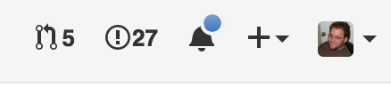

# gh-nag

Never Forget a PR or issue on one of your repositories again!

The more successful your GitHub projects become, the easier it becomes to forget to follow up on an open issue or pull request. This Chrome extension tries to assist in that process by providing a counter in the upper right of the GitHub Web UI that links to open issues and PR's on your repositories. Of course, you could do this yourself by typing specific query params into GitHub search tool, but this provides a shortcut, and a counter display to nag you into taking action:  

## Installation

Clone this repo, then:

	$ npm install
	$ npm run build:chrome

Go to `Settings` `=>` `Extensions` in Chrome, and choose "Load unpacked extension", and choose the `dist/chrome` directory created in the previous step.

Open the extensions `Options` page, and enter your `username` and an access `token`. It is recommended you [create a new one](https://github.com/settings/tokens) specifically for this extension. You can leave all the checkboxes blank, the extension needs no special permissions (it only looks at publicly available data - the token is only required to prevent GitHub API rate limiting).

----

# Contributing

WARNING - Everything below was auto-generated by a yoeman generator. I have not vetted it for accuracy.

## Usage

Run `$ gulp --watch` and load the `dist`-directory into chrome.

## Entryfiles (bundles)

There are two kinds of entryfiles that create bundles.

1. All js-files in the root of the `./app/scripts` directory
2. All css-,scss- and less-files in the root of the `./app/styles` directory

## Tasks

### Build

	$ gulp

| Option         | Description                                                                                                                                           |
|----------------|-------------------------------------------------------------------------------------------------------------------------------------------------------|
| `--watch`      | Starts a livereload server and watches all assets.  To reload the extension on change include `livereload.js` in your bundle.                      |
| `--production` | Minifies all assets                                                                                                                                   |
| `--verbose`    | Log additional data to the console.                                                                                                                   |
| `--vendor`     | Compile the extension for different vendors (chrome, firefox, opera)  Default: chrome                                                                 |
| `--sourcemaps` | Force the creation of sourcemaps. Default: !production                                                                                                |

### pack

Zips your `dist` directory and saves it in the `packages` directory.

    $ gulp pack --vendor=firefox

### Version

Increments version number of `manifest.json` and `package.json`, 
commits the change to git and adds a git tag.

    $ gulp patch      // => 0.0.X
 
or 

    $ gulp feature    // => 0.X.0

or 

    $ gulp release    // => X.0.0

## Globals

The build tool also defines a variable named `ENV` in your scripts. It will be set to `development` unless you use the `--production` option.

**Example:** `./app/background.js`

	if(ENV === 'development'){
		console.log('We are in development mode!');
	}

	

